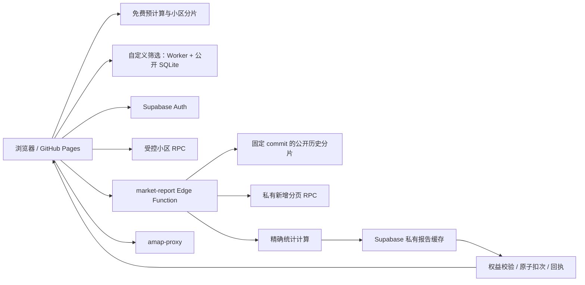

# 北京房价研究站：背景、重构进展与接续工作

核对日期：2026-09-23。接手基线：`main` / `190a14f9a89516fb0e74337f74e92596346af0c8`；以下前半部分保留接手审计，第 9 节记录修复结果。

当前结论：默认、24 个月同比、自定义历史基准、区域筛选及真实付费共享扣次已通过云端验收；计算器已改为受保护的分任务精确计算。最终完整历史基期边界验证也已通过，发布状态见第 9 节。第 5–8 节中的“当前”均指接手时刻，保留用于解释重构起因。

## 1. 项目背景与需求演化

最初目标是为本人购房提供数据参考：通过北京历年二手房成交记录，比较北京整体、不同区和小区的价格变化及相对抗跌表现。用户强调滑动区间统计、面积结构、成交量、样本门槛、动态排行，以及真实渲染和操作验收。

之后发展出两条相互支持的产品线：

- 数据研究站：小区查询、成交与挂牌曲线、议价空间、市场趋势、区域排行和地图；逐步增加免费访问、注册试用和人工售卖兑换码。
- 内容与获客：小红书“北京看房笔记”系列、海淀相对抗跌分析、商品介绍材料。历史产物已存在，本轮核心是研究站后端重构。

| 阶段 | 需求与已发生的变化 |
| --- | --- |
| 9 月 11–12 日 | 从原始 Excel 建立 Python/SQLite 本地看板；明确滑动中位数等口径、成交量与面积、区/小区排行和地图；小区搜索独立于排行门槛。 |
| 9 月 13–16 日 | 增加小区定位、挂牌/成交双曲线、议价阴影、时间框选和小区热力图；开始内容制作；9 月 15 日首次发布 GitHub Pages。 |
| 9 月 15 日 | 合并用户补充的 2026 年数据，做重复匹配、缺失分析及地理增强；用户明确昂贵新数据暂不公开上传。 |
| 9 月 17–18 日 | 确认免费截至 2025-08-31、私有新增从 2025-09-01 开始；引入 Supabase、邮箱验证、两个小区试用、绑定邮箱兑换码、管理员后台与限次；优化站点 UI、按需加载和高德代理。 |
| 9 月 22 日 | 加入记住登录 7 天；用户指出管理员市场分析仍只有旧数据，确认新一轮市场报告、公私数据拼接和共享扣次重构。 |
| 9 月 22–23 日 | 发布报告缓存和受控计算，随后将大 SQL 请求改为 Edge 流式计算，再将月分片补充为年度分片；真实云端报告仍触发资源上限。 |

主历史任务是“设计北京房价分析看板”（`01a09119-2bcf-75c2-835e-8cdc4a08f1ae`）。本次读取了原始对话，确认 9 月 22 日用户已同意方案、要求重构、充分测试及验证通过后推送。历史中后续“继续工作”与本次接手属于同一业务目标。

## 2. 已确认的产品规则

1. 未登录可查看所有小区截至 2025-08-31 的免费历史及免费市场统计，不扣试用额度。
2. 验证邮箱后，累计选择两个不同小区，解锁这两个小区的私有新成交；名额按账号保存，同小区重复查看不重复占用。
3. 付费账号兑换绑定账号的有效兑换码后，查询一份最新市场报告扣一次，查询一个非试用小区的新成交扣一次，共用余额。
4. 管理员应看到所有面板的最新数据，不需要兑换码、不扣次数。9 月 22 日之前“管理员仅能查最新小区、市场仍旧”的行为已不满足最新需求。
5. 同一请求在短时网络重试中不得重复扣次；计算失败不应产生新的扣次。服务器完成交付但客户端断线，需要按请求回执处理，不能承诺浏览器没显示就一定未扣。
6. 已加载报告内的排序、Top K 和支持的区域下钻复用报告；改变需要重新计算的条件才产生新报告请求。
7. 免费历史尽量不持久写入 Supabase；只存新增私有成交、账号权益和有预算/过期管理的私有报告缓存。
8. 新成交不进入 GitHub、公开 SQLite 或公开预计算。前端遮罩不能代替服务端鉴权。
9. 售卖采用微信人工联系、人工确认后管理员发码；自动支付、完整订单财务和退款系统尚未实现。

## 3. 数据现状：不同数量代表不同阶段

本次重新查询了本地只读数据库和构建元数据：

| 数据阶段 | 数量 | 日期范围或解释 |
| --- | ---: | --- |
| 最初旧 Excel | 435,008 | 历史审计记录：2018-04-04 至 2025-08-01；当时 8 月只有一天。 |
| 合并后的原始记录 | 513,981 | 保守匹配和源内去重后的中间成果；当前构建元数据仍记录这一输入数量。 |
| 本地清洗有效记录 | 509,901 | `data/transactions.sqlite3`，2018-04-04 至 2026-08-29。 |
| 公开免费记录 | 445,034 | `docs/data/transactions.sqlite3`，2018-04-04 至 2025-08-31。 |
| 私有新增记录 | 64,867 | 本地有效库中 2025-09-01 起的记录；历史导入和对账记录确认已存 Supabase 私有 schema，本次未重新查询云端逐笔表。 |

513,981 到 509,901 的差额 4,080 条，在构建元数据中分解为：缺位置 3,560 条、异常值 519 条、重复 1 条。不是同一个口径下数据丢失。全量清洗库有 7,950 个小区组合，公开库有 7,945 个，不能与未清洗合并包的小区统计直接混用。

历史“免费默认到 2025-07”的结论只适用于最初那份 Excel。后续补充数据已经覆盖 2025 年 8 月，当前公开快照默认到 2025-08。最新 2026 年 8 月只到 29 日，页面已标注并非完整自然月。

数据是多来源平台样本，不能等同于官方全市成交总量。旧新来源在挂牌价、成交周期等字段上存在缺失和口径差异；价格代表值变化也受到面积、户型和成交结构影响。

## 4. 现有架构与入口



| 位置 | 当前职责 |
| --- | --- |
| `analytics.py`、`app.py` | 本地计算与 HTTP 服务；保留本地参考实现。 |
| `scripts/build_database.py`、`public_data.py` | 输入清洗、本地数据库、公开日期隔离。 |
| `static/app.js`、`static/access.js` | 图表、市场模式、权限 UI、最新报告请求与退出清理。 |
| `static/cloud-entry.mjs`、`static/auth-storage.mjs` | Supabase 客户端、接口、登录持久化；`cloud.js` 为打包产物。 |
| `static/pages-*.js`、`scripts/build_fast_pages.mjs` | 免费预计算、分片、Worker 和 SQLite 回退。 |
| `static/admin.*` | 邮箱绑定发码、限次配置、私有缓存管理。 |
| `supabase/migrations/` | 当前有 8 个 SQL 文件，覆盖账号/试用/兑换/管理员/地图限制/报告缓存/计算/私有分页。 |
| `supabase/functions/market-report/handler.mjs` | 验证身份、规范参数、缓存与计算 lease、读取公私输入、保存和交付报告。 |
| `supabase/functions/market-report/compute.mjs` | 线上新 Edge 统计器，当前主要性能调查对象。 |
| `supabase/functions/market-report/contract.mjs` | 参数和窗口规范、48 个月趋势、算法版本与缓存键。 |
| `scripts/build_public_history.py` | 免费库生成可核验的月度及年度分片、manifest。 |
| `scripts/export_pages_site.py`、`scripts/check_public_release.py` | 构建 `docs/` 和审计公开数据边界。 |
| `.github/workflows/` | Pages 发布、本地回归、公共端点检查、管理员最新报告检查。 |

源码在 `static/`，`docs/` 是公开部署产物。后续改页面应从源码修改并重建，避免两套副本偏离。旧 `access_control.py` 与本地 token 工具为兼容/原型遗留，不能替代新版 Supabase 权益。

当前缓存实现含：参数规范化、公开 manifest 版本、私有数据 revision、算法版本；默认 TTL 7 天、缓存 payload 预算 35 MiB；计算 lease 120 秒、同账号限制及全站最多 3 个计算任务；回执重试窗口 10 分钟。预算是 payload 预算，不代表整个数据库实际磁盘上限。

## 5. 最新重构实际停在哪里

### 已提交与部署

- `4d060cf`：受控最新市场报告、共享缓存和扣次。
- `d411515`：Edge 流式统计、私有数据分页，避免原方案将大量公开明细放入单个数据库请求。
- `190a14f`：增加年度公开分片，减少冷请求的 HTTP 下载数量。
- 历史工具记录显示第 009 号私有分页迁移和最新 `market-report` 函数均已部署。
- 本次 GitHub API 确认远端 `main` 与本地 HEAD 都是 `190a14f`；接手时工作区干净。

### 尚未打通的验收

最新 [Pages 发布任务](https://github.com/muziyongshixin/beijing-housing-dashboard/actions/runs/35811876251) 成功；同一提交的 [管理员报告任务](https://github.com/muziyongshixin/beijing-housing-dashboard/actions/runs/35811904866) 失败。后者在 2026-09-23 10:50:21（北京时间）返回：

```text
HTTP 546 on /functions/v1/market-report
code: WORKER_RESOURCE_LIMIT
Function failed due to not having enough compute resources (please check logs)
```

该日志证明真实云端报告请求失败，但仅凭它不能确定具体为 CPU 还是内存限额。年度分片优化之后仍失败，因此不能继续把问题仅归结为下载次数或网络等待。

### 本次补充的诊断证据

使用当前 Edge 计算器，在本地 Node 对真实本地数据进行了单次默认场景测量；不访问云端，不保存私有报告：

- 默认最新 6 个月相邻窗口，趋势回看 48 个月；需要 41 个免费历史月份，实际读取 2022–2025 四个年度分片，共解析 257,483 行公开记录，再按月份筛选。
- 加入 64,867 条私有记录，结果含 16 个区、6,388 个候选小区和 48 个全市趋势点，序列化报告约 3.62 MB。
- 解析公开分片约 94 ms，公开累计约 53 ms，私有累计约 63 ms，`finish()` 约 2,538 ms，总计约 2,751 ms，进程 CPU 约 2,881 ms。
- 整个 Node 进程最大 RSS 约 359 MiB，包含本地测试准备和数据装载；不是云端实例的内存测量，也不能直接据此认定云端 OOM。

源码显示 `finish()` 为多个区域、多个滚动月份重复拼接价格/面积/周期/议价数组并排序。它是值得优先分析的计算热点。分片并发解析、数据复制和垃圾回收也是后续测量项。

## 6. 本次核验与发现的缺口

| 本次实际执行 | 结果 |
| --- | --- |
| `npm run test:ui` | 40 / 40 通过。 |
| `npm run test:permissions` | 51 / 51 通过。 |
| `npm run test:pages` | 5 / 5 通过。 |
| `python3 -m unittest discover -s tests -v` | 33 / 33 通过。 |
| `python3 scripts/check_public_release.py` | 通过；445,034 条，最晚 20250831。 |
| 正式站浏览器免费市场 | 已显示真实指标、15 个合格区排行、公开数据日期；非空页面。 |
| 正式站“阳光南里”搜索及详情 | 显示 49 笔免费成交、曲线、议价区间及逐笔表；私有部分显示解锁入口。 |
| 真实管理员最新报告 | 本次读取最新已完成的云端失败日志，没有重新创建管理员登录会话。 |

测试总数 129 项。但有一个重要覆盖断层：`tests/report_full_parity.mjs` 执行的是第 008 号迁移里的旧 SQL 计算器；线上后续改用的 `compute.mjs` 只有 3 项小样本测试。旧全量 SQL 对账不能自动证明新 Edge 统计器所有结果正确，且旧脚本的数值断言主要覆盖全市 benchmark，其他结果也需要扩展核对。

正式站此次打开时，高德地图仍显示“需要配置高德地图”。本机直连配置端点得到 TLS EOF；历史中用户也确认过 Wi-Fi 无法连接 Supabase、移动网络可以。这里记录为当前访问环境下的连通性/提示问题，不能据此宣称云端密钥未配置。它与 GitHub runner 中报告计算返回 HTTP 546 是两个问题。

本次未完成真实邮件收发、付费账号扣次端到端、云端多连接竞争、手机触摸或最新报告完整浏览器回归；不能把 JSDOM/PGlite 或免费页抽查当作这些验收。

## 7. 文档与交付遗留

- `README.md` 仍写“最新全市聚合未实现”及“三份迁移”，与当前代码不一致。
- `SUPABASE_PLAN.md` 的部署结构仍写主要交给 PostgreSQL 拼接计算，自动验收数量也落后于当前版本；它保留了产品规则和早期设计依据，但不能作为最终运行架构的唯一依据。
- GitHub 当前仍有 `SUPABASE_SERVICE_ROLE_KEY` 和 `HOUSING_ADMIN_EMAIL` 两个测试用 secret。这里只核对了名称，无读取或披露值。历史原定验收后清理，尚待决定按临时测试用途清理还是纳入正式测试凭据管理。
- 最新报告入口和相关文案已上线，云端关键验收却失败；应优先修复可靠性并给出准确错误/重试状态。
- 自动支付、套餐价格与完整订单/退款属于另外的产品工作，不应混入本轮报告重构导致范围扩大。

## 8. 后续工作的执行顺序与完成标准

1. **建立当前 Edge 计算器的真实数据基线。** 用完整有效库覆盖默认 6 月、24 月同比、自定义历史基准、局部面积/户型筛选；对齐全市、区、小区、趋势、量、样本资格和地图，而非只对齐总价指标。
2. **定位并降低冷计算资源消耗。** 分阶段测量下载/校验/解压/解析/累计/排序/序列化；优先减少滚动趋势重复拼接和排序，控制峰值内存。若仍无法符合部署环境，应调整计算任务边界，同时保留用户选择的公私数据隔离、精确统计和免费优先约束。不得用“中位数的中位数”偷换精确合并口径。
3. **验证云端真实完整链路。** 管理员直接读最新市场不扣次；付费报告和小区共用次数；失败不产生新扣次；同请求重试不重复扣；缓存命中仍鉴权；失效/撤销/余额用尽后行为正确；并发不重算失控、不重复扣次。
4. **完成桌面和窄屏浏览器验收。** 最新趋势、排行、地图、账号退出与切回免费、下钻和 Top K；将网络连接失败与计算资源错误分别处理。
5. **收尾发布。** 同步 README 和 Supabase 交接说明，重建公开产物、跑全量回归和公开边界保护，再推送及部署正确 commit/manifest 对应的 Edge Function；检查正式 URL 与管理员烟测，处理测试用 secrets。

完成标准：真实管理员和付费账号能够按规则取得含 2026 年数据的完整市场报告，计算与基准对账一致，在当前部署资源内运行，且免费访问与私有数据隔离保持正确。当前还没有达到这一标准。

## 9. 2026-09-23 修复与验收

### 最终计算架构

- `market-report` 保留唯一用户入口，负责真实 Auth 校验、参数规范化、计算租约、私有缓存、原子扣次和回执交付。
- 内部 `market-compute` 只接受服务端凭据，拒绝用户 JWT；每个任务先核验租约和权益。分别计算全市/区汇总、小区排行、全市趋势和各区趋势，汇合后一次存储与扣次。浏览器不能上传历史事实或指定数据地址。
- 免费历史仍从固定 commit `190a14f9a89516fb0e74337f74e92596346af0c8` 的公开分片按需读取，逐文件核验大小和 SHA-256，原始免费事实不持久写入 Supabase。公开分片未变化，因此无需改动这个输入版本。
- 汇总分位数采用有界精确选择；滑动趋势复用按月排序的原始值，通过有序合并与移除维护窗口。没有使用月中位数平均、抽样或近似分位数。
- 先前默认失败主要由重复排序造成；日志证实长窗口还曾达到约 2 秒 CPU 上限。完整历史自定义基期另外触发 256 MB 内存上限，促使汇总与小区排行进一步拆开。最终缓存算法版本为 `market-edge-v5`。

### 已执行的验证

- 41 项 UI、55 项权限/服务端、6 项 Pages、33 项 Python 测试，共 135 项。
- `tests/report_full_parity.mjs` 逐字段比对完整报告与独立 PostgreSQL SQL 参考，包括 benchmark、区、小区、地图、48 个月趋势、样本资格和各辅助指标；额外对分任务重组结果做同样比对。真实有效数据 509,901 条、私有增量 64,867 条，覆盖默认、24 月同比、自定义 2018 年基期及海淀中关村面积/户型筛选。
- 云端 [管理员与付费验收 35816432230](https://github.com/muziyongshixin/beijing-housing-dashboard/actions/runs/35816432230) 成功：管理员默认最新/重试不扣次；长窗口、自定义基期、局部筛选成功；付费无效参数不扣次，同 request_id 并发只扣一次，小区与报告共享余额，最后一次额度竞争只允许一笔成功，零余额合法回执仍可重试。
- 真实云端事务验证到期与撤销：市场和小区回执失效，旧报告重试被拒绝。测试变更回滚；临时 Auth 账号、兑换码及其回执已清理，并查询确认账号和兑换码均为零。
- 真实浏览器以生产静态产物和本机真实完整报告验收：管理员登录后自动显示 2026-08-29、海淀下钻、Top 5、价格曲线、区域地图、桌面和 390px 布局、退出后回到免费范围；没有页面横向溢出。修复了自动切换最新月份后比较区间说明仍为旧月份的问题。
- 浏览器最新报告验收采用仅绑定 loopback 的合成账号，真实云端 Auth/计算/扣次由上面的网络验收覆盖；本机网络无法稳定直连 Supabase，未声称正式站浏览器已完成真实管理员登录。高德底图连通性未作为通过项，错误提示已从“需要配置”改为“暂时无法连接”。区级 SVG 地图正常。
- 公开数据保护通过：445,034 条、最晚 20250831。私有报告验收产物仅存 `.private/`，不进入 Git 或 docs。

### 复现入口与运行限制

- 常规回归：`npm run test:ui`、`npm run test:permissions`、`npm run test:pages`、`python3 -m unittest discover -s tests`。
- 真实数据对账：`node tests/report_full_parity.mjs`，需本地有效库，不在公开 CI 上传私有输入。
- 本地视觉复查：`node tests/market_preview_data.mjs` 后运行 `python3 tests/market_preview_server.py`，打开 `http://127.0.0.1:18881/`。明确为合成登录，无邮件发送。
- 冷报告需要读取公开历史和私有分页，最终版本已测 24 月同比约 42 秒，缓存约 3 秒；不是即时计算。所有计算失败不产生新扣次，已成功交付后的网络重试依赖 10 分钟回执窗口。
- 内部任务最多四份，受原有最多三份报告租约约束；任务不持久保存中间明细。生产保留私有报告缓存预算与 TTL。
- 自动支付、定价、退款财务与内容发布不属于本轮重构。

最终 `market-edge-v5` 全量对账四场景全部通过（约 230 秒，本地参考 SQL 为主要耗时）。[云端完整历史基期及内部入口隔离验收 35830191474](https://github.com/muziyongshixin/beijing-housing-dashboard/actions/runs/35830191474) 已成功，覆盖 24 月当前窗口 + 2018-01 至 2026-08 全历史基准、24 月同比、自定义短基期、局部筛选，并验证用户 JWT 无法调用内部计算接口。主分支发布和最后一次烟测见 GitHub Actions 最新运行。

### 发布末轮浏览器补修与清理

- Safari 末轮复查发现免费页可能停在“正在计算”。相同发布文件在本机 Safari 能完成，线上文件及预计算数据 HTTP 200、SHA-256 与发布文件一致。补上动画帧等待的 100ms 兜底：后台/被遮挡页面即使不触发 `requestAnimationFrame` 也会启动计算；新增此情形回归。
- 免费 Worker 请求增加主线程总超时，初始化 45 秒、自定义计算 240 秒；超时终止旧 Worker、释放并发请求，下次重试重新初始化，迟到消息无法污染新请求。新增无响应、并发失败、重建和迟到事件回归。地图连接失败时同步更新状态文字。
- [管理员与付费最终云端验收 35830854728](https://github.com/muziyongshixin/beijing-housing-dashboard/actions/runs/35830854728) 和 [公开云端端点验收 35830851245](https://github.com/muziyongshixin/beijing-housing-dashboard/actions/runs/35830851245) 均通过；其后补修只涉及浏览器等待/错误状态，无服务端计算或扣次变化。
- 临时 QA Auth 账号、兑换码和回执已清理；GitHub 临时 `SUPABASE_SERVICE_ROLE_KEY`、`HOUSING_ADMIN_EMAIL` 已删除，secret 列表为空。生产 Supabase 配置保留。重跑管理员烟测需由维护者临时配置这两项 GitHub secrets，完成后清理。
